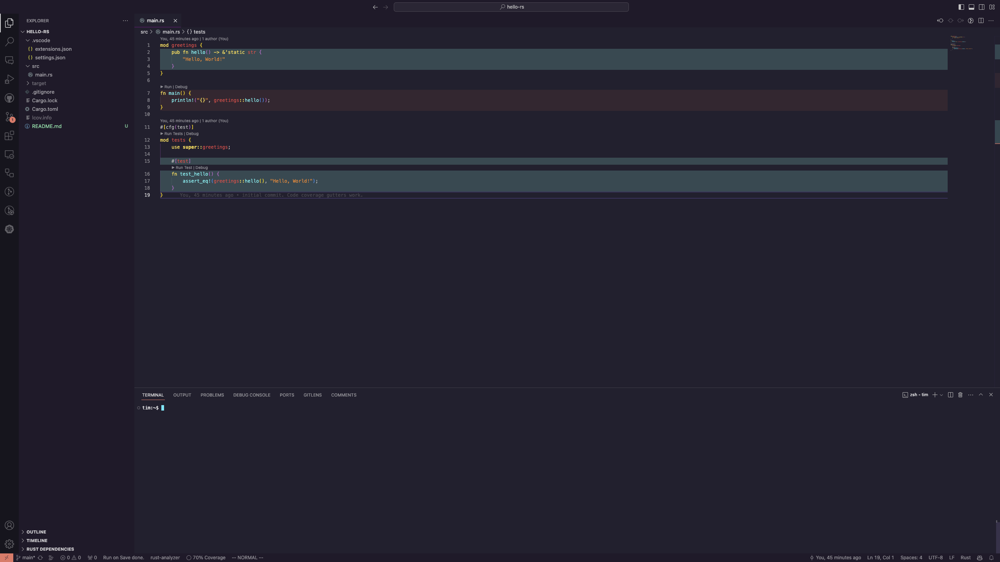

# hello-rs

hello-rs is a simple example repo to show how you can get started with test driven development in Rust.

Go has in-line running tests, debugging, and code highlighting baked into their official vscode extension but it turns out most other languages don't have code hightlighting like this by default. This repo shows how you can get started with test driven development in Rust with code highlighting in vs-code.

 covered by tests being highlighted green.](./screenshots/golang-gutters.png)

I was surprised to find that there wasn't a simple way to get code highlighting like this for Rust. I'm sure there are other ways to do this but this is the simplest way I found.
 


All of the example code we're testing can be found in [src](./src) and comes from this article by @janis_t on twitter [article](https://www.typescriptbites.io/articles/build-test-and-publish-typescript-npm-package-2022) by [@janis_t on twitter](https://twitter.com/janis_t).


## Install

This assumes you already have rustc and cargo installed. If you don't, you can install them with [rustup](https://rustup.rs/).

```git clone https://github.com/TimothyStiles/hello-rs && cd hello-rs && code .```

Then:

1. Install the recommended vs-code extensions through the dialogue that should pop up when you first open the project.
2. Close out the window
3. Reopen the project with vs-code and extensions installed.
4. Open `src/main.rs`.
5. Hit `command + s`

 Now `src/main.rs` should have the code gutters like in the above screenshot.


## Other Languages
* [hello-ts](https://github.com/TimothyStiles/hello-ts) (typescript)


## Sponsor

* **[Sponsor](https://github.com/sponsors/TimothyStiles):** 🤘 Thanks for your support 🤘


## License

* [MIT](LICENSE)

* Copyright (c) 2023 Timothy Stiles